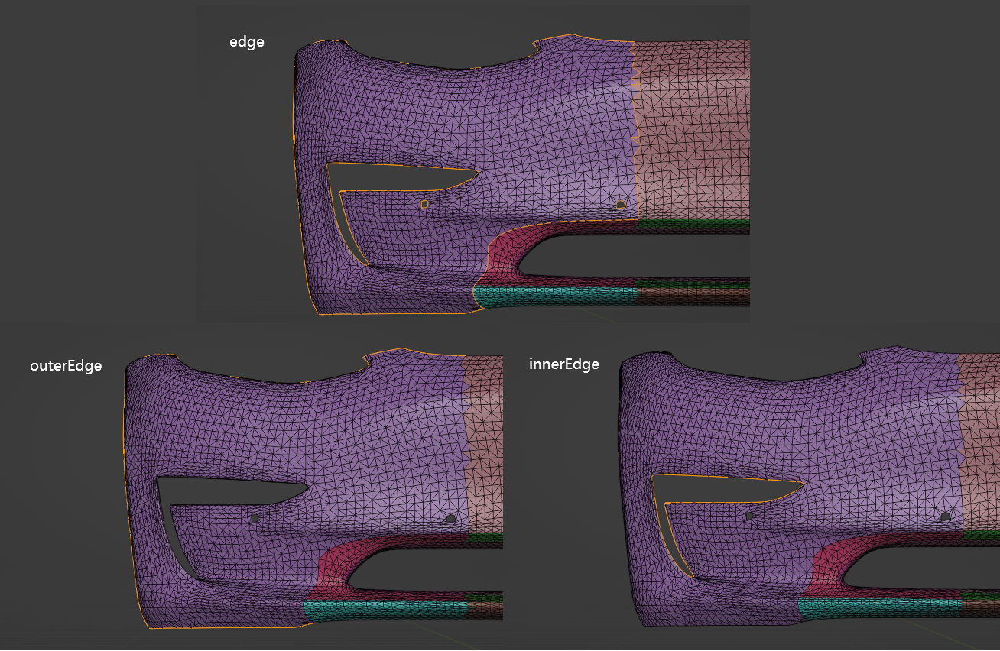
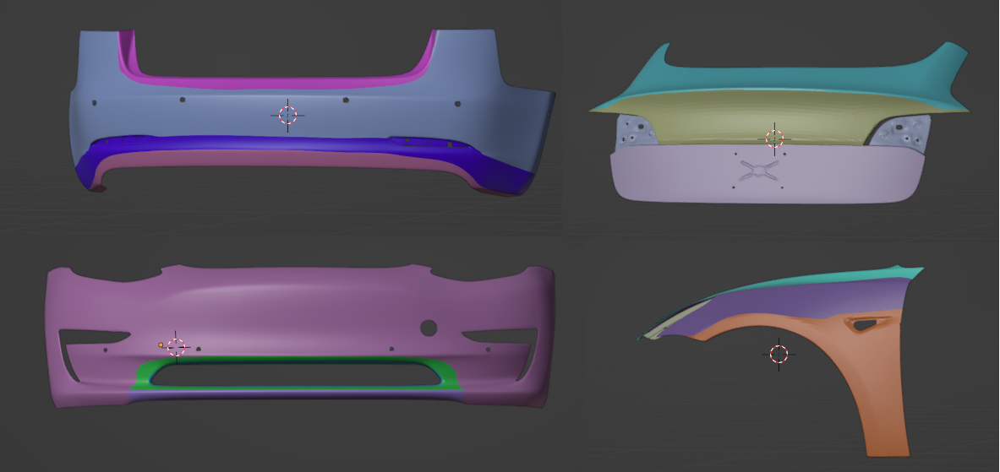
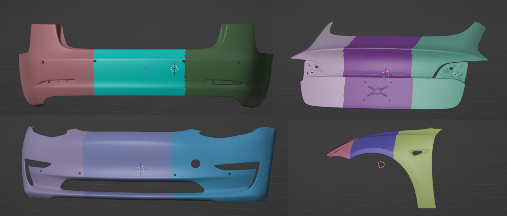
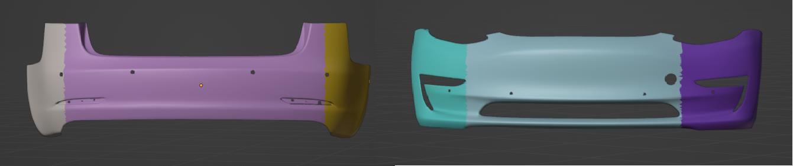

# Model-partitioning-based-on-features

## PART 1

```
基于模型特征的分块
```




- 按照模型特征进行分块



## PART 2

```
基于OBB包围盒的均匀分块 与 基于曲率的模型分块
```

- 长边方向均匀分块



- 按照曲率分块



## PART 3

```
将上述两种分块方法结合起来，同时要考虑小分区的合并
```

